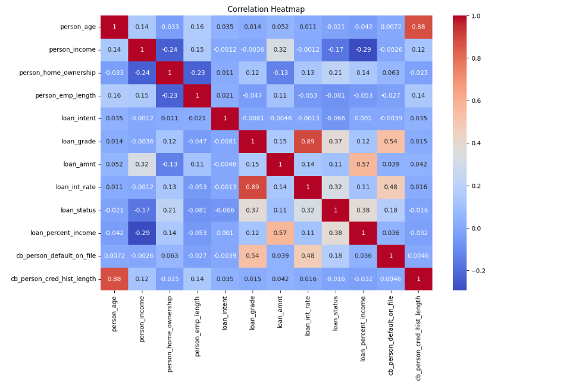
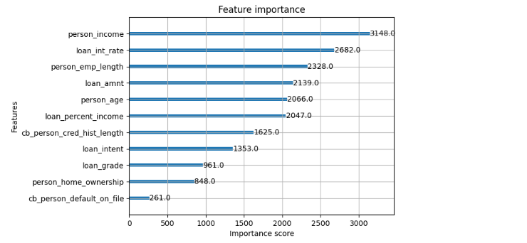
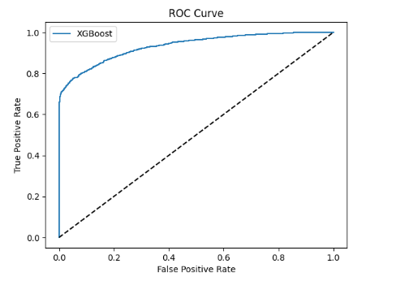
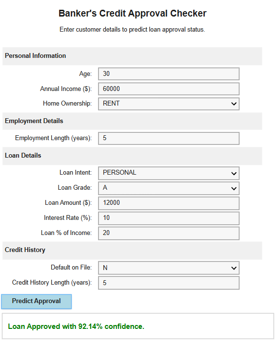

# Machine Learning-Based Loan Default Risk Prediction

This repository presents a complete machine learning pipeline for predicting loan default risk using the Credit Risk Dataset from Kaggle. The system analyzes customer financial and credit-related information, performs data preprocessing and exploratory analysis, trains machine learning models, and provides an interactive interface for real-time prediction.

The project is implemented in a Jupyter Notebook and can be executed on Google Colab or locally.

## Overview

Loan default prediction is an important task in the banking and finance sector. Financial institutions need reliable systems to evaluate applicants and reduce the chances of loan default.

This project builds a machine learning-based prediction system that classifies loan applicants as low-risk or high-risk based on features such as age, income, employment length, loan amount, interest rate, loan purpose, home ownership status, and credit history.

The main model used in this project is XGBoost. It is compared with baseline models such as Logistic Regression and Random Forest. The project also handles class imbalance using SMOTE and improves model performance through hyperparameter tuning.

An interactive widget-based interface is also included, allowing users to enter applicant details and receive real-time prediction results with confidence scores.

## Features

- Data preprocessing and cleaning
- Missing value imputation
- Outlier removal
- Categorical feature encoding
- Feature scaling
- Exploratory Data Analysis
- Correlation heatmap
- Statistical testing
- Class imbalance handling using SMOTE
- XGBoost model training
- Hyperparameter tuning using GridSearchCV
- Model comparison with Logistic Regression and Random Forest
- Model evaluation using classification metrics
- ROC curve visualization
- Feature importance analysis
- Interactive prediction interface using IPyWidgets

## Dataset

The dataset used in this project is the Credit Risk Dataset from Kaggle. It contains applicant information and loan status details.

The dataset contains approximately 32,581 records and 12 features.

### Key Features

- `person_age`
- `person_income`
- `person_home_ownership`
- `person_emp_length`
- `loan_intent`
- `loan_grade`
- `loan_amnt`
- `loan_int_rate`
- `loan_status`
- `loan_percent_income`
- `cb_person_default_on_file`
- `cb_person_cred_hist_length`

### Target Variable

- `loan_status`

Where:

- `0` represents a non-default / approved case
- `1` represents a default-risk / rejected case

The dataset is imbalanced, with a larger number of non-default cases compared to default cases.

## Sample Data

| person_age | person_income | person_home_ownership | person_emp_length | loan_intent | loan_grade | loan_amnt | loan_int_rate |
|---|---:|---|---:|---|---|---:|---:|
| 22 | 59000 | RENT | 123.0 | PERSONAL | D | 35000 | 16.02 |
| 21 | 9600 | OWN | 5.0 | EDUCATION | B | 1000 | 11.14 |

## Technologies Used

- Python
- Jupyter Notebook
- Google Colab
- Pandas
- NumPy
- Matplotlib
- Seaborn
- Scikit-learn
- XGBoost
- Imbalanced-learn
- Statsmodels
- IPyWidgets

## Methodology

### 1. Data Loading and Preprocessing

The dataset is loaded and cleaned before model training. Missing values are handled using imputation techniques, unrealistic outliers are removed, categorical variables are encoded, and numerical features are scaled.

### 2. Exploratory Data Analysis

Exploratory Data Analysis is performed to understand the relationship between different variables and loan default risk. The analysis includes summary statistics, distribution plots, count plots, and correlation analysis.

### 3. Statistical Analysis

Statistical tests are used to study the importance and relationship of different features. Chi-Square Test is used for categorical variables, T-Test is used for numerical variables, and VIF is used to check multicollinearity.

### 4. Handling Class Imbalance

Since the dataset contains more non-default cases than default-risk cases, SMOTE is applied to balance the dataset and improve model learning.

### 5. Model Training

The primary model used in this project is XGBoost Classifier. Hyperparameter tuning is performed using GridSearchCV to improve performance.

Baseline models are also trained for comparison:

- Logistic Regression
- Random Forest

### 6. Model Evaluation

The trained models are evaluated using different performance metrics:

- Accuracy
- Precision
- Recall
- F1-Score
- ROC-AUC Score
- Confusion Matrix
- Cross-validation score

### 7. Model Explainability

Feature importance analysis is used to identify which input variables have the most influence on loan default prediction.

### 8. Interactive Prediction Interface

An interactive widget-based prediction system is included in the notebook. Users can enter applicant details such as age, income, employment length, loan amount, interest rate, and credit history.

The system then predicts whether the applicant is likely to be a low-risk or high-risk borrower.

## Interactive Demo

The notebook includes an interactive form named:

### Loan Default Risk Prediction Assistant

This interface allows users to input customer information and receive real-time predictions with confidence scores.

## Results and Insights

The project demonstrates how machine learning can be used to support credit risk analysis in banking. XGBoost performs effectively because it can capture complex patterns in financial data.

The feature importance results help identify the most influential factors affecting loan default risk, while the ROC curve and evaluation metrics show the model's classification performance.

## Conclusion

This project provides an end-to-end machine learning workflow for loan default risk prediction. It includes data preprocessing, exploratory data analysis, statistical testing, class imbalance handling, model training, model comparison, evaluation, visualization, and interactive prediction.

The project is useful for understanding how machine learning can be applied in banking, finance, and credit risk assessment.

## Repository Summary

A machine learning project for predicting loan default risk using customer financial and credit-related data. The system uses XGBoost, SMOTE, statistical analysis, model evaluation, and an interactive prediction interface to support credit risk assessment.
